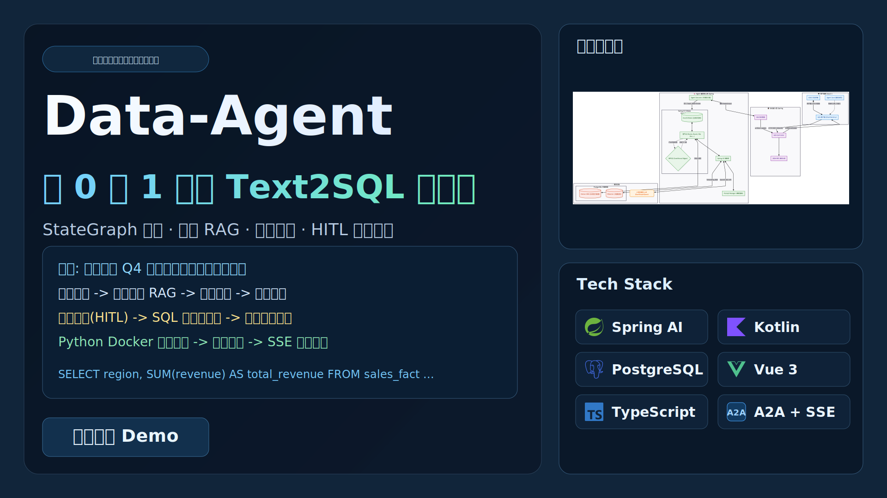
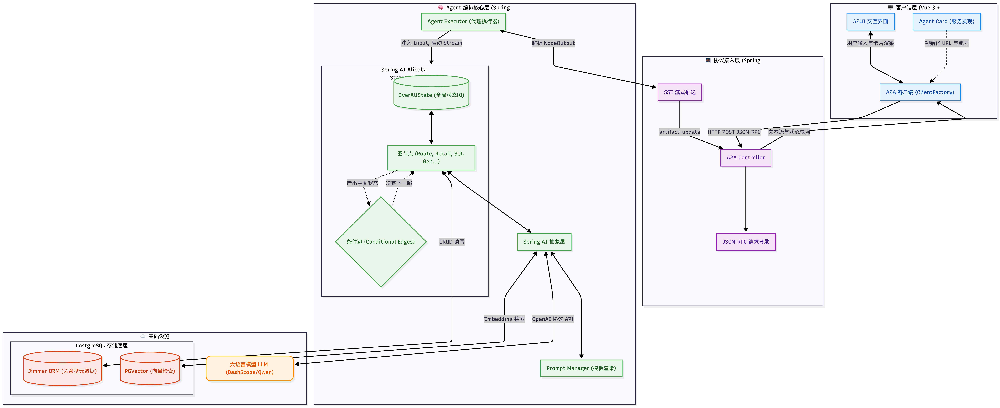
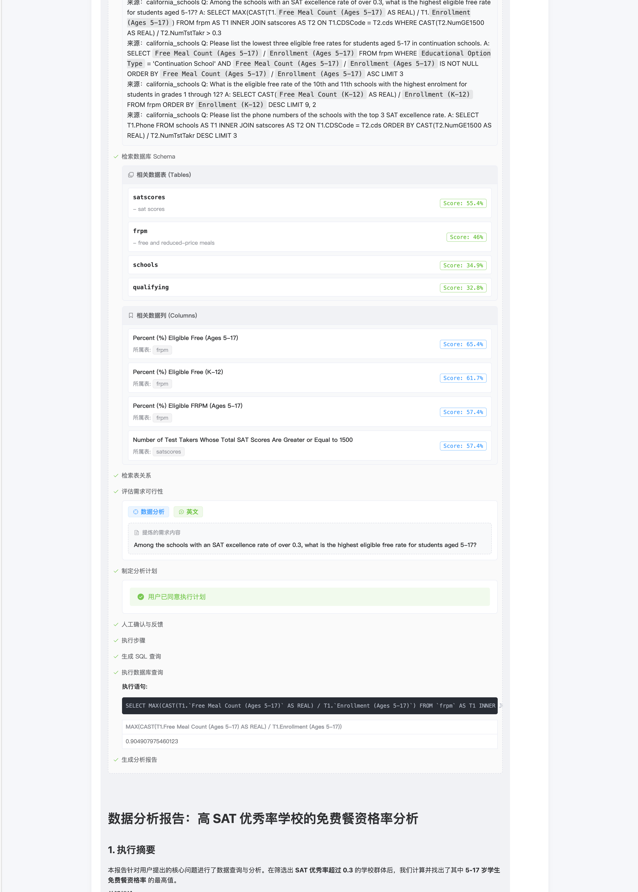
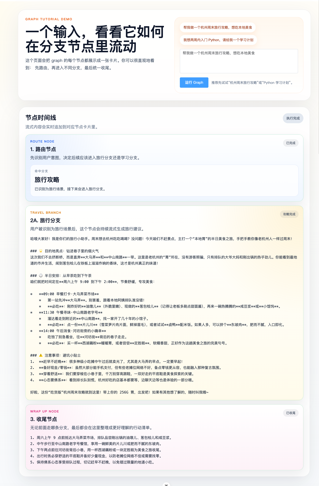
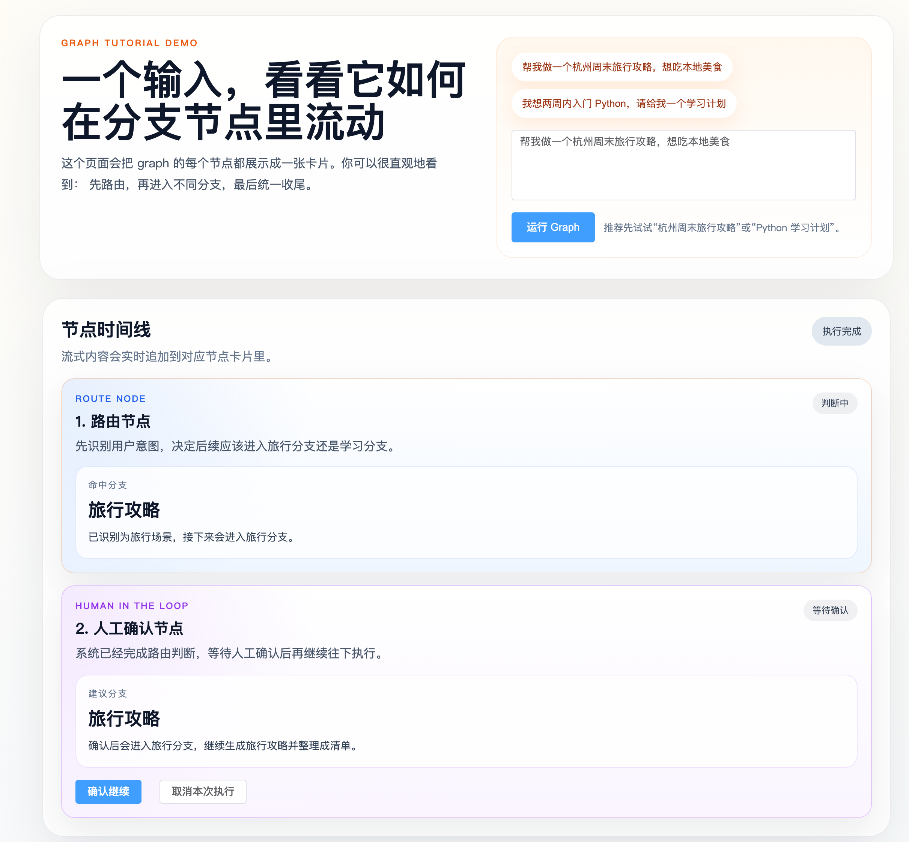

# 🚀 Data-Agent: 从 0 到 1 构建企业级 Text2SQL 智能体

> **告别“玩具级” Demo！** 本教程专为想把大模型应用从 POC 落地到生产环境的开发者打造。
> 我们将自顶向下，带你从搭建基础架构开始，一步步构建一个具备**图编排 (StateGraph)**、**双重 RAG 检索**、**自我纠错 (Self-Correction)** 以及**人机协同 (HITL)** 能力的工业级 Text2SQL 数据智能体。

📚 **项目仓库:** [data-agent-tutorial](https://github.com/qifan777/data-agent-tutorial) | 🔗 **参考项目:** [spring-ai-alibaba/DataAgent](https://github.com/spring-ai-alibaba/DataAgent) | 💡 **学习策略:** 分支对照，每章即刻运行，所见即所得。

-----

## 🖼️ 项目介绍图

[点击查看原图](./video-cover.svg)



-----

## ✨ 核心亮点：你将学到什么？

传统 Text2SQL 往往面临“表结构喂不下”、“模型老写错”、“缺乏业务常识”三大死穴。本项目通过现代 Agent 架构逐一击破：

* 🧠 **状态图编排 (StateGraph)**：告别面条代码，将“问题理解 ➔ 知识召回 ➔ 可行性评估 ➔ SQL 生成 ➔ 校验修复 ➔ 报告输出”拆解为可观测、可控制的独立图节点。
* 📚 **双重 RAG 知识底座**：不只搜索文本！融合结构化元数据（表/列/外键关联）与非结构化业务知识（Bird SQL 数据集、QA 问答），精准消除大模型幻觉。
* 🤝 **人机协同 (HITL) 与 A2A 协议**：原生集成 A2A (Agent-to-Application) 协议与流式输出 (SSE)，在危险操作前支持人工确认与接管，打造流式全异步的企业级交互体验。
* 🛡️ **全自动纠错闭环**：自带 SQL 执行与 Python Docker 沙盒执行。遇到语法或数据错误自动回溯修复，输出即用。

## 🛠️ 现代化技术栈强强联合

* **后端支撑**：`Kotlin` + `Spring Boot 3.x` + `Jimmer` (极具革命性的强类型 ORM)
* **AI 与编排**：`Spring AI Alibaba Graph` + `Spring AI`
* **向量与存储**：`PostgreSQL` + `pgvector` (本地化高性能向量检索)
* **前端交互**：`Vue 3` + `TypeScript` + `Vite` + `A2UI`

-----

## 🧭 宏观系统架构图 (System Architecture)

[点击查看原图](./A2A-client-server.png)



-----

## 🗺️ 端到端执行链路速览

```text
[用户自然语言提问] 
   └── A2A 协议流式请求 
        └── 🚦 路由意图识别
             ├── 📚 知识召回 (向量化业务词汇 + QA)
             ├── 🗄️ 关系图谱召回
             ├── ⚖️ 可行性评估与任务拆解 (Planner)
             ├── ⏸️ 人工确认拦截 (HITL)
             ├── 💻 SQL 生成与执行 + 自动纠错循环
             ├── 🐍 Python Docker 沙盒执行与分析
             └── 📊 报告整理 (Report Generation)
                  └── 前端流式打字机效果呈现 (A2UI)
```

-----

## 🖼️ 效果预览

### 最终效果（长截图）

[点击查看原图（完整长图）](./demo.png)



### 关键交互细节

#### 多节点编排效果

[点击查看原图](./img.png)



#### 人工确认（HITL）效果

[点击查看原图](./img_1.png)



-----

## ⚡ 快速启动 (5 分钟极速体验)

为了让开发者快速上手，我们提供了最小可运行闭环。

### 1\. 环境准备

* **基础环境**: Java 17+ | Node.js 20+ | pnpm
* **数据库**: PostgreSQL（默认连接 `localhost:5432/data_agent_tutorial`）
* **依赖插件**: 必须安装并激活 `pgvector` 扩展。
  > 💡 **Tip:** 连接数据库后执行 `CREATE EXTENSION IF NOT EXISTS vector;` 激活。

### 2\. 配置密钥与启动后端

1. 进入 `data-agent-backend`，检查 `application.yml` 中的大模型 API-KEY 和数据库账号。
2. 启动 Spring Boot 服务：
   ```bash
   ./gradlew bootRun
   ```
   *(出现 `Tomcat started on port(s): 9933` 即为启动成功)*

### 3\. 启动前端与代理

进入 `data-agent-frontend` 目录：

```bash
pnpm install
pnpm dev
```

*(默认在 `http://localhost:3500` 启动，自动代理 `/api` 到后端)*

### 4\. 验证 A2A 链路

打开浏览器，发送一个自然语言问题，如果看到前端卡片开始呈现**流式节点打字机效果**，恭喜你，最小 Agent 闭环已通！

-----

## 📖 教程导航 (自顶向下进阶)

本教程按章节组织，**强烈建议切换到对应章节的 Git 分支**对照阅读源码，效果翻倍！

* 🏗️ **[00 项目骨架搭建](https://www.jarcheng.top/project/data-agent/00-project-scaffold/)**
  * 后端 Kotlin + Jimmer 初始化，前端 Vue3 接入 API 自动生成。
* 🔌 **[01 A2A 协议实战](https://www.jarcheng.top/project/data-agent/01-a2a-workflow/)**
  * 抛弃传统 HTTP 问答，跑通 Agent 服务发现与 JSON-RPC 流式事件。
* 🕸️ **[02 Graph 编程基础](https://www.jarcheng.top/project/data-agent/02-graph-programming/)**
  * 从单节点走向多分支路由，实现 `暂停 -> 人工确认 -> 续跑` 的 HITL 工作流。
* 🧠 **[03 Bird SQL 知识库基建](https://www.jarcheng.top/project/data-agent/03-bird-sql-knowledge/)**
  * 硬核解析业界最难的 BIRD 数据集，完成结构化表关联入库与 PGVector 向量化。
* 🔥 **[04 SQL Agent 核心编排](https://www.jarcheng.top/project/data-agent/04-sql-agent-orchestration/)** *(系列高潮)*
  * 逐个击破：知识召回、关系图谱、任务拆解、SQL 自纠错、Python 高阶计算以及商业报告生成！
